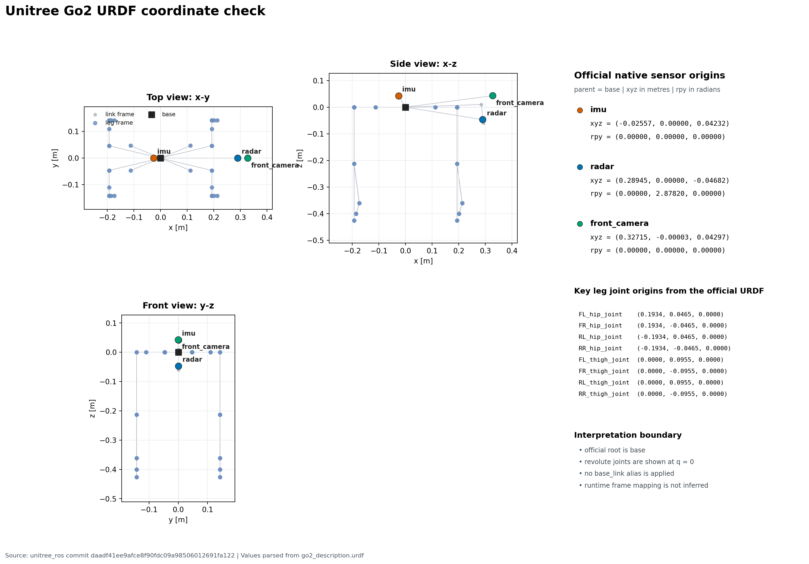

# `description`

이 패키지는 공식 Go2 전체 URDF와 프로젝트의 정적 TF 계약을 보관한다.
canonical model은 `urdf/go2_description.urdf` 하나이며, 공식·프로젝트 root는
`base`다. 이 파일에는 Go2 본체의 visual·collision·inertial·관절과 공식 native
sensor link인 `imu`, `radar`, `front_camera`가 함께 들어 있다.

## 현재 승인된 정적 TF 계약

- 공식 고정 edge `base → imu`와 `base → radar`의 geometry는 canonical URDF를
  기준으로 하며, `robot_state_publisher`가 소유한다.
- `/utlidar/cloud`에서 관찰된 runtime frame_id는 `utlidar_lidar`다.
- 사용자가 설치 센서의 물리 정렬을 확인했으므로, 프로젝트는 공식
  `radar_joint` geometry를 direct `base → utlidar_lidar` transform으로 수용한다.
  이는 독립 온보드 calibration이 아니라 프로젝트 통합 결정이다.
- direct edge의 owner는 bringup을 통한
  `tf2_ros/static_transform_publisher`다. geometry는 translation
  `[0.28945, 0.0, -0.046825]`, rpy `[0.0, 2.8782, 0.0]`다.
- 정적 TF bringup은 bringup에서 구현되었고, 2026-08-23 AGX에서 launch와
  runtime TF 조회를 완료했다. `/tf_static`에는 두 publisher가 있었고 세 핵심
  edge가 해석됐다. `robot_state_publisher`가 `/tf` publisher와
  `/joint_states` subscription을 광고하는 것은 확인했지만, `/tf` message와
  `/joint_states` publisher는 관찰되지 않았다. 이 결과는 동적 joint TF나
  joint-state 입력의 검증을 의미하지 않는다.

초기 프로젝트는 `utlidar_imu` 또는 RealSense를 입력으로 사용하지 않는다.
`config/frame_contract.yaml`은 공식 reference, 관찰된 onboard runtime frame,
프로젝트가 수용한 mapping, runtime instantiation 결과를 분리해 기록한다.
공식 모델의 범위와 기준 출처는 `urdf/go2_description.urdf`와 아래 좌표 확인
이미지에 반영되어 있다.

- 기준 커밋: `daadf41ee9afce8f90fdc09a98506012691fa122`
- [Unitree 공식 go2_description.urdf](https://github.com/unitreerobotics/unitree_ros/blob/daadf41ee9afce8f90fdc09a98506012691fa122/robots/go2_description/urdf/go2_description.urdf)



## 공식 모델의 읽기 구조

canonical URDF의 구조는 다음과 같다.

```text
go2_description.urdf
└── base
    ├── Head_upper → Head_lower
    ├── FL_hip → FL_thigh → FL_calf → FL_foot
    ├── FR_hip → FR_thigh → FR_calf → FR_foot
    ├── RL_hip → RL_thigh → RL_calf → RL_foot
    ├── RR_hip → RR_thigh → RR_calf → RR_foot
    ├── imu
    ├── radar
    └── front_camera
```

공식 URDF는 구조와 기준값을 보관하는 asset이며 자체적으로 publisher를
실행하지 않는다. bringup이 `robot_state_publisher`와 direct static transform의
실행을 담당한다. 2026-08-23 runtime 결과와 teardown은
`records/experiments/go2_local_navigation_static_tf_bringup_20260823.md`에
기록했다.

## 폴더 및 파일 구조

```text
description/
├── README.md
├── package.xml
├── setup.py
├── setup.cfg
├── resource/
│   └── description
├── config/
│   ├── body_model.yaml
│   └── frame_contract.yaml
├── urdf/
│   ├── go2_description.urdf
│   └── go2_description_coordinate_check.png
└── description/
    └── __init__.py
```

## 파일별 역할

| 파일 | 역할 |
| --- | --- |
| `README.md` | 공식 reference, 관찰 runtime frame, 프로젝트 수용 mapping, runtime 검증 결과를 구분해 설명한다. |
| `package.xml` | ROS 2 metadata와 향후 description 사용에 필요한 의존성을 선언한다. |
| `setup.py` | 공식 URDF·문서·YAML asset의 설치 경로를 정의한다. TF publisher는 등록하지 않는다. |
| `setup.cfg` | 개발·설치 시 script 경로를 지정한다. |
| `resource/description` | ament index가 패키지를 찾기 위한 빈 marker 파일이다. |
| `config/body_model.yaml` | 공식 URDF에서 반복 검색하기 좋은 주요 관절값만 뽑은 YAML projection이다. 실행 geometry source로 직접 사용하지 않는다. |
| `config/frame_contract.yaml` | `base` root, `robot_state_publisher`의 공식 fixed edge, bringup `static_transform_publisher`의 direct LiDAR edge와 각 상태·소유자·출처를 구조화한다. |
| `urdf/go2_description.urdf` | Unitree 공식 고정 커밋의 전체 Go2 URDF를 보존하는 canonical model이다. |
| `urdf/go2_description_coordinate_check.png` | 공식 URDF에서 계산한 native sensor·주요 관절 원점의 좌표 투영을 확인하는 이미지다. 실행 asset이나 TF publisher가 아니다. |
| `description/__init__.py` | Python 패키지 경계와 TF 모델의 미확정 상태를 설명한다. |

이 패키지는 공식 URDF asset과 계약만 제공한다. 추가 장비의 외부 파라미터를
확인하면 공식 파일을 덮어쓰지 않고 별도 overlay와 출처 record를 추가한다.
